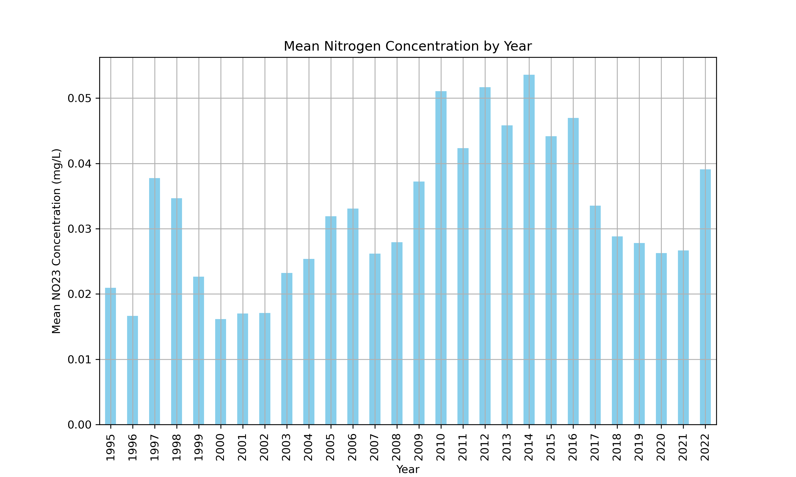
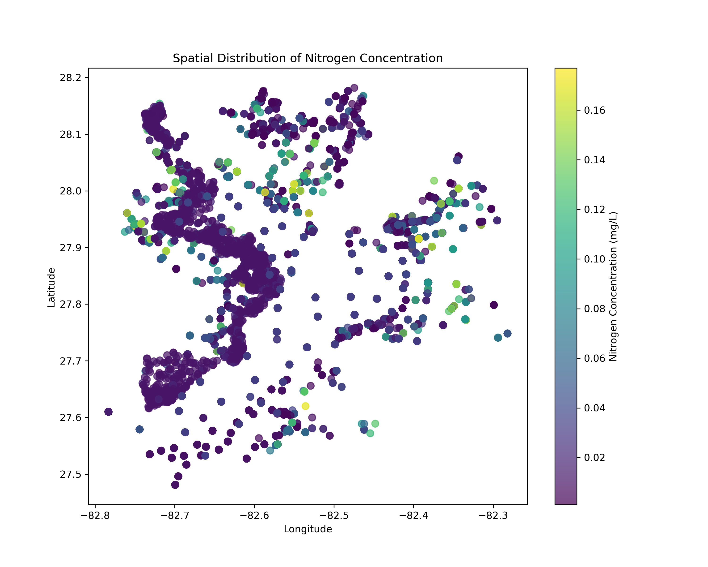

# Water Quality Analysis Report - BlueGAP

## Introduction

This report presents the findings from the analysis of water quality data, focusing on the concentration of nitrogen (NO23) across various stations over time. Our objective is to identify trends, distribution, and outliers in the nitrogen concentrations, which will aid in environmental assessments and regulatory compliance efforts.

## Data Overview

The data set consists of measurements from multiple water quality monitoring stations, including parameters like date, location (latitude and longitude), and nitrogen concentration (NO23).

## Data Cleaning and Preprocessing

+ Data was preprocessed to ensure accuracy and relevance:
  + Unnecessary columns such as 'uni' were removed as they contained redundant information.
  + Outliers were identified and removed using the Interquartile Range (IQR) method to focus on typical data ranges.

## Analysis

### Mean Nitrogen Concentration by Year

+ The annual mean concentration of nitrogen was calculated to observe trends over the years. This helps in understanding long-term changes in water quality.
[View the Data Analysis Notebook](http://localhost:8888/notebooks/01_Data_Analysis.ipynb)

### Spatial Distribution of Nitrogen Concentration

+ A spatial analysis was performed to identify geographical patterns and potential hotspots of nitrogen concentration.
+ View the Visualization Notebook
(./notebooks/02_Visualization.ipynb)

## Interactive Visualizations

+ Explore interactive visualizations to get a more dynamic understanding of data distributions and patterns.
+ View the Interactive Visualizations Notebook
(./notebooks/03_Interactive_Visualizations.ipynb)

## Conclusion

+ The analysis highlighted significant variations in nitrogen concentration across different years and locations. Understanding these variations is crucial for targeted environmental protection and remediation efforts.

## Recommendations

+ Continued monitoring and more focused studies on identified hotspots are recommended to assess the sources and impacts of nitrogen concentrations.
+ Implementing advanced analytical techniques like time series forecasting could provide further insights into future trends.

### Note

+ To view the Jupyter notebooks, ensure you have Jupyter Notebook installed on your system.
